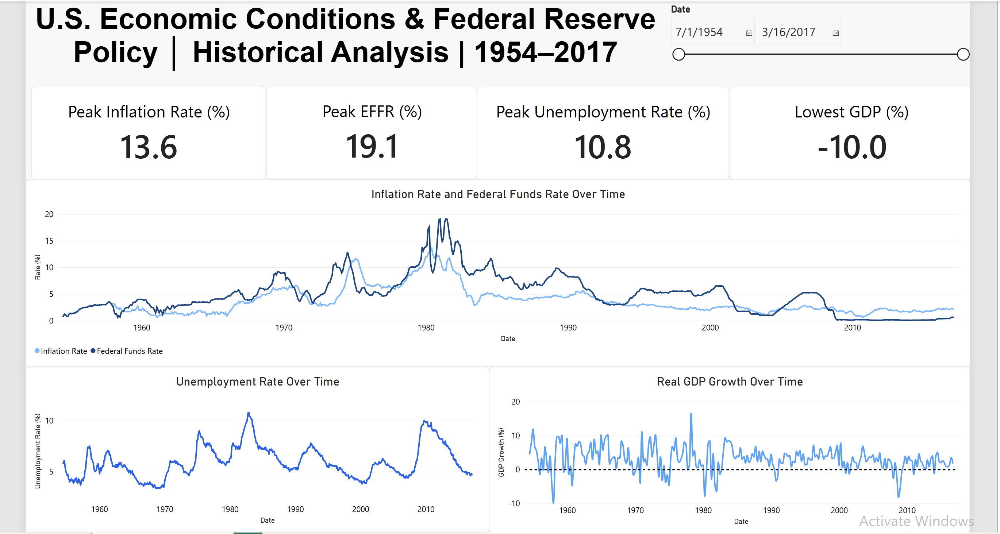

# U.S. Economic Conditions & Federal Reserve Policy Analysis

## Project Overview

This project analyzes historical U.S. economic data to explore how Federal Reserve interest-rate policy relates to inflation, unemployment, and economic growth.

The analysis covers data from 1954 through March 2017 and uses Python for data cleaning and exploratory analysis, SQL for answering business questions, and Power BI for creating an interactive executive dashboard.

## Business Objective

The goal of this project was to answer several key questions:

- How have inflation, unemployment, GDP growth, and federal funds rates changed over time?
- What relationship exists between inflation and the Effective Federal Funds Rate?
- How did interest rates differ during periods of high inflation?
- Which periods experienced unusually high inflation, unemployment, or negative GDP growth?
- How can these findings be communicated effectively through an interactive dashboard?

## Tools Used

- **Python:** Pandas, NumPy, Matplotlib, Seaborn
- **SQL:** SQLite
- **Power BI:** Data visualization and interactive dashboard
- **Jupyter Notebook / Google Colab:** Analysis environment

## Data Preparation

The dataset contained economic indicators reported at different frequencies, resulting in structural missing values. These values were preserved rather than automatically removed.

The Federal Reserve also transitioned from a single target rate to a target range in December 2008. I created one consistent target-rate field by using the original target when available and the midpoint of the upper and lower range afterward.

```python
df['Federal Funds'] = np.where(
    df['Federal Funds Target Rate'].notna(),
    df['Federal Funds Target Rate'],
    (df['Federal Funds Upper Target'] +
     df['Federal Funds Lower Target']) / 2
)
```

**Insight:** Investigating the missing data before cleaning prevented valid observations from being removed simply because the indicators were reported at different frequencies.

---

## Inflation & Federal Funds Rate

I examined the relationship between inflation and the Effective Federal Funds Rate using correlation analysis.

```python
correlation_data = df[[
    'Effective Federal Funds Rate',
    'Real GDP (Percent Change)',
    'Unemployment Rate',
    'Inflation Rate'
]]

correlation_matrix = correlation_data.corr()
```
### Correlation Matrix

| | Effective Federal Funds Rate | Real GDP | Unemployment Rate | Inflation Rate |
|---|---:|---:|---:|---:|
| **Effective Federal Funds Rate** | 1.00 | -0.10 | 0.04 | **0.78** |
| **Real GDP** | -0.10 | 1.00 | -0.03 | -0.18 |
| **Unemployment Rate** | 0.04 | -0.03 | 1.00 | 0.21 |
| **Inflation Rate** | **0.78** | -0.18 | 0.21 | 1.00 |

The correlation between inflation and the Effective Federal Funds Rate was **0.78**, the strongest relationship among the indicators examined.

A scatterplot was then used to visualize the relationship.

```python
sns.scatterplot(
    data=df,
    x='Inflation Rate',
    y='Effective Federal Funds Rate'
)
```

**Insight:** Higher inflation generally coincided with higher federal funds rates, although the variation in rates shows that inflation alone does not explain interest-rate levels.

---

## High-Inflation Periods

SQL was used to compare interest rates during high- and lower-inflation observations.

```sql
SELECT
    CASE
        WHEN "Inflation Rate" >= 8 THEN 'High Inflation'
        ELSE 'Lower Inflation'
    END AS Inflation_Category,
    AVG("Effective Federal Funds Rate") AS Avg_EFFR
FROM economic_data
WHERE "Inflation Rate" IS NOT NULL
GROUP BY Inflation_Category;
```

**Insight:** When inflation was **8% or higher**, the Effective Federal Funds Rate averaged **12.17%**, compared with **4.42%** when inflation was below 8%.

---

## Economic Contractions

I used SQL to identify which years contained the most quarters of negative GDP growth.

```sql
SELECT
    strftime('%Y', Date) AS Year,
    COUNT("Real GDP (Percent Change)") AS GDP_Count
FROM economic_data
WHERE "Real GDP (Percent Change)" < 0
GROUP BY Year
ORDER BY GDP_Count DESC;
```

**Insight:** Of 250 reported GDP-growth quarters, **33 (13.2%)** were negative. **1974 and 2008** each contained three negative-growth quarters, the highest number in an individual calendar year.

---

## High-Unemployment Periods

A Common Table Expression (CTE) was used to isolate high-unemployment observations before analyzing interest rates.

```sql
WITH High_Unemployment AS (
    SELECT
        Date,
        "Unemployment Rate",
        "Effective Federal Funds Rate"
    FROM economic_data
    WHERE "Unemployment Rate" >= 8
)

SELECT
    AVG("Effective Federal Funds Rate") AS Avg_EFFR
FROM High_Unemployment;
```

**Insight:** During observations with unemployment of at least 8%, the Effective Federal Funds Rate averaged approximately **4.43%**. The same-period correlation between unemployment and EFFR was only **0.04**, substantially weaker than the inflation-rate relationship.

---

## Power BI Dashboard

The final dashboard brings the major indicators together and includes an interactive date filter for exploring different historical periods.



The full Power BI file is available in the `dashboard` folder, and the complete Python and SQL analysis is available in the Jupyter notebook.

---

## Limitations

Economic indicators in the dataset are reported at different frequencies, and the dataset ends in March 2017. The relationships identified are descriptive historical associations and should not be interpreted as evidence of causation.

The dataset ends in March 2017 and therefore should not be interpreted as representing current U.S. economic conditions.

The analysis primarily examines historical associations and descriptive patterns. Correlation does not establish causation, and economic policy decisions may reflect additional factors not represented in this dataset.

